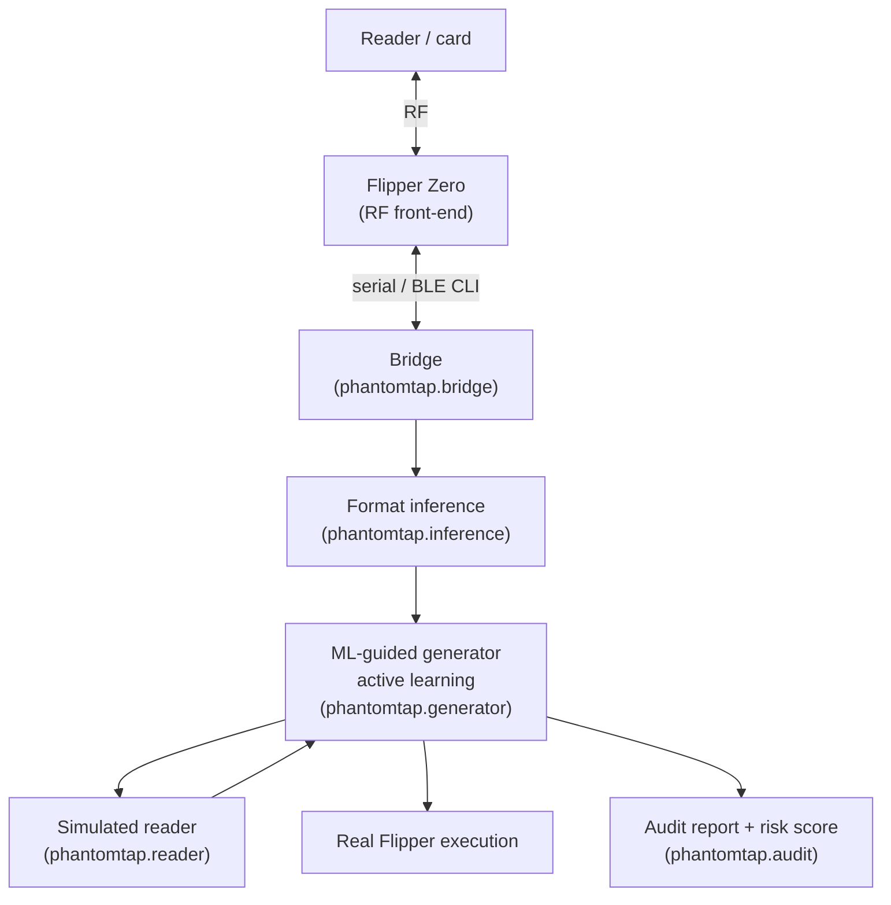

<h1 align="center">PhantomTap</h1>

<p align="center">
  <b>A Flipper Zero that stops guessing and starts reasoning.</b><br>
  ML-guided RFID/NFC fuzzing &amp; access-control auditing — turning raw card reads
  into a prioritized, explainable security assessment.
</p>

<p align="center">
  
  
  
  
  
</p>

<p align="center">
  <code>rfid</code> · <code>nfc</code> · <code>flipper-zero</code> ·
  <code>access-control</code> · <code>security-audit</code> ·
  <code>wiegand</code> · <code>mifare</code> · <code>active-learning</code> ·
  <code>physical-security</code> · <code>pentesting</code>
</p>

---

> **Defensive-use tool.** The deliverable is an audit report a physical-security
> assessor or building owner uses to *find and fix* weak badge systems — not a
> device for unauthorized entry. All experiments use **synthetic** credential
> populations or the author's **own** cards/readers. See
> [`docs/threat_model.md`](docs/threat_model.md).

## The idea

The Flipper Zero is a brilliant manual multi-tool for RFID/NFC — but it's
fundamentally *dumb*: it replays, dumps, and brute-forces with fixed
dictionaries, leaving all the reasoning to the human. Meanwhile real
access-control ecosystems have **structure**: credential formats, facility
codes, numbering schemes, weak default keys.

**PhantomTap bolts a brain onto the Flipper.** A host-side layer:

1. **learns the structure** of the credentials it sees (format, facility code,
   numbering scheme) from just a handful of reads;
2. **generates the next-best test credential** with an active-learning policy
   instead of blind brute force; and
3. **produces a scored, explainable audit report** ranking how weak a
   deployment is, and why, with concrete remediation.

### Headline result

Across every format × numbering configuration, ML guidance characterizes 90% of
an issued credential population with a **median of ~22,000× fewer reader
queries** than brute force (min 135×, max 180,498×).

<p align="center">
  
</p>

## Why it's novel

- The Flipper community builds **tools, not intelligence**. Existing apps
  replay, dump, and dictionary-attack; almost none *learn credential structure*
  and use it to guide search.
- **Credential-format inference from a few observations** is an under-explored,
  tractable ML problem.
- It **bridges hardware hacking and structured software security** — an embedded
  RF device plus host-side sequence modelling plus a reporting engine.
- The **"auditor" inversion**: turning offensive capability into a scored,
  explainable audit is the practical, defensible contribution.

## Architecture



Full write-up: [`docs/architecture.md`](docs/architecture.md).

## Quickstart

```bash
git clone https://github.com/Krishita17/PhantomTap.git
cd PhantomTap
python -m pip install -e .          # Tier-1 core: ZERO third-party deps

# End-to-end walkthrough on a synthetic deployment:
phantomtap demo

# Score a deployment and render an audit report:
phantomtap audit --format H10301-26 --numbering sequential --out report.md

# Attempts-to-characterize: ML vs. dictionary vs. brute force:
phantomtap benchmark --numbering sequential
```

The **entire Tier-1 pipeline runs on the Python standard library alone** — no
hardware, no heavy dependencies. Figures and tests add `matplotlib`, `numpy`,
and `pytest`:

```bash
python -m pip install -e ".[dev]"
make test          # 21 tests
make figures       # regenerate every chart into docs/figures/
make benchmark     # regenerate docs/benchmark_results.md
```

## What you get

### 1. Format inference from a few reads

```text
$ phantomtap demo
2. Auditor captures 8 card reads:
    H10301-26 FC=83 CN=11067 raw=0x2A65677 parity=ok
    ...
3. Inferred structure from those 8 reads:
    { "format": "H10301-26", "facility_code": 83,
      "numbering": "sequential", "card_lo": 10944, "card_hi": 11305, ... }
4. Attempts-to-characterize (queries to map 90% of the population):
      bruteforce: 5,450,824
      dictionary: 7,416,904
              ml: 443
   -> PhantomTap is ~12,304x more efficient.
```

### 2. A scored, explainable audit report

See the full rendered example: [`examples/sample_audit_report.md`](examples/sample_audit_report.md).

| # | Severity | Factor | Finding |
|---|----------|--------|---------|
| 1 | 🟥 CRITICAL | `numbering` | Card numbers issued strictly sequentially |
| 2 | 🟥 CRITICAL | `keys` | Sectors still carry publicly documented default keys |
| 3 | 🟧 HIGH | `format` | H10301-26 (26-bit): tiny 8-bit facility space |
| … | … | … | … |

## Results

Median over 8 seeds · 8 observed cards · 400 issued credentials per deployment.
Full table + JSON: [`docs/benchmark_results.md`](docs/benchmark_results.md).

| Format | Numbering | Brute force | Dictionary | **ML (PhantomTap)** | Speedup | Fmt acc | Num acc |
|--------|-----------|------------:|-----------:|--------------------:|--------:|:------:|:------:|
| H10301-26 | sequential | 7,977,297 | 9,943,377 | **353** | 22,599× | 1.00 | 1.00 |
| H10301-26 | clustered  | 8,011,137 | 9,977,217 | **357** | 22,440× | 1.00 | 0.12 |
| H10301-26 | random     | 8,022,236 | 9,988,316 | **59,151** | 136× | 1.00 | 1.00 |
| N10002-34 | sequential | 7,977,297 | 9,943,377 | **353** | 22,599× | 1.00 | 1.00 |
| H10304-37 | sequential | 63,715,665 | 79,444,305 | **353** | 180,498× | 1.00 | 1.00 |
| H10304-37 | random     | 64,178,091 | 79,906,731 | **474,255** | 135× | 1.00 | 1.00 |

**How the win works.** ML makes two moves the baselines can't: it (1) *locks the
facility code* inferred from the reads (dividing the space by the whole
facility range), and (2) *region-grows* over card numbers from the observed
cluster, walking a sequential/clustered population directly instead of scanning
empty low-numbered space. Even on **random** numbering — where region-growing
gives no signal — locking the facility code alone yields a ~135× win.

<p align="center">
  
  
</p>
<p align="center">
  
</p>

### Honest limitations

- **Width ambiguity.** A wide format carrying small values leaves its
  high-order bits zero and is *parity-indistinguishable* from a narrower format.
  PhantomTap reports the **narrowest consistent** format and lists the wider
  ones it is also consistent with (that's what the "Fmt acc" = consistent
  recovery measures).
- **Clustered vs. sequential** is genuinely hard from a sparse 8-card sample
  (`Num acc ≈ 0.12` for clustered); both collapse into a "predictable" class.
  This is reported, not hidden.

## Credential-format taxonomy

| Format | Bits | Facility | Card | Known weakness |
|--------|-----:|---------:|-----:|----------------|
| H10301-26 | 26 | 8-bit (0–255) | 16-bit | Tiny facility space; trivial to guess/collide |
| N10002-34 | 34 | 16-bit | 16-bit | Small per-facility card space stays enumerable |
| H10304-37 | 37 | 16-bit | 19-bit | Resists enumeration, but sequential numbering is fully predictable |

Details + citations: [`data/reference/wiegand_formats.md`](data/reference/wiegand_formats.md)
· default-key reference: [`data/reference/default_keys.md`](data/reference/default_keys.md).

## Project layout

```
phantomtap/
  formats.py      Wiegand format definitions, parity, encode/decode
  population.py   synthetic credential-population generator (the workbench)
  reader.py       simulated reader (accept/reject oracle, counts queries)
  inference.py    format-inference parser (format, facility, numbering, range)
  generator.py    brute-force / dictionary baselines + ML-guided auditor
  audit.py        weighted risk scoring + Markdown report renderer
  bridge.py       Tier-2 Flipper Zero serial bridge (+ hardware-free mock)
  keys.py         publicly documented default keys (for detection)
  cli.py          `phantomtap` command-line entry point
scripts/          make_figures · run_benchmark · demo
tests/            21 pytest cases
docs/             architecture · threat_model · figures · benchmark results
data/             synthetic samples + public reference material
examples/         a rendered sample audit report
```

## Roadmap (tiers)

- [x] **Tier 1 — software pipeline (no hardware).** Inference + ML-guided
  generator + audit report, benchmarked against baselines. *(This repo.)*
- [ ] **Tier 2 — hardware integration.** Drive a real Flipper over its serial
  CLI on the author's own cards/readers. Seam is [`phantomtap/bridge.py`](phantomtap/bridge.py).
- [ ] **Tier 3 — research payoff.** Upgrade the generator to a richer
  sequence/active-learning model; expand the deployment-weakness study.

## Threat model & ethics

PhantomTap is for **authorized, defensive** assessment and research. Testing any
system you do not own requires prior written authorization from its owner. The
repo ships no real facility credentials, no site-specific keys, and no
"clone-a-stranger's-badge" workflow. Read [`docs/threat_model.md`](docs/threat_model.md)
before using the hardware path.

## Citation

If you use PhantomTap, please cite it — see [`CITATION.cff`](CITATION.cff).

## Author

**Krishita Sanjay Choksi** — sole author and contributor.

## Acknowledgements

Portions of the scaffolding and documentation were drafted with AI assistance
and reviewed by the author. The design, framing, and all experimental results
are the author's own.

## License

[MIT](LICENSE), with a responsible-use notice.
