<h1 align="center">PhantomTap</h1>

<p align="center">
  <b>A Flipper Zero that stops guessing and starts reasoning.</b><br>
  ML-guided RFID/NFC fuzzing &amp; access-control auditing — turning raw card reads
  into a prioritized, explainable security assessment.
</p>

<p align="center">
  
  
  
  
  
</p>

<p align="center">
  <code>rfid</code> · <code>nfc</code> · <code>flipper-zero</code> ·
  <code>access-control</code> · <code>security-audit</code> ·
  <code>wiegand</code> · <code>mifare</code> · <code>active-learning</code> ·
  <code>bayesian</code> · <code>purple-team</code> ·
  <code>threat-detection</code> · <code>counter-surveillance</code> · <code>skimmer-detection</code> ·
  <code>attack-graph</code> · <code>osint</code> · <code>privacy</code> ·
  <code>physical-security</code> ·
  <code>pentesting</code>
</p>

---

> **Defensive-use tool.** The deliverable is an audit report a physical-security
> assessor or building owner uses to *find and fix* weak badge systems — not a
> device for unauthorized entry. All experiments use **synthetic** credential
> populations or the author's **own** cards/readers. See
> [`docs/threat_model.md`](docs/threat_model.md).

## The idea

The Flipper Zero is a brilliant manual multi-tool for RFID/NFC — but it's
fundamentally *dumb*: it replays, dumps, and brute-forces with fixed
dictionaries, leaving all the reasoning to the human. Meanwhile real
access-control ecosystems have **structure**: credential formats, facility
codes, numbering schemes, weak default keys.

**PhantomTap bolts a brain onto the Flipper.** A host-side layer:

1. **learns the structure** of the credentials it sees (format, facility code,
   numbering scheme) from just a handful of reads;
2. **generates the next-best test credential** with an active-learning policy
   instead of blind brute force; and
3. **produces a scored, explainable audit report** ranking how weak a
   deployment is, and why, with concrete remediation.

### Headline results

**1. Characterization efficiency.** Across the full format × numbering sweep, ML
guidance characterizes 90% of an issued population with a **median ~16,000×
fewer reader queries** than brute force (max **180,498×**). The one configuration
where it gives *no* advantage — a facility-less **H10302** format with
**randomized** numbering (1×) — is exactly the hardened design defenders should
aim for, and the benchmark reports it plainly rather than hiding it.

<p align="center">
  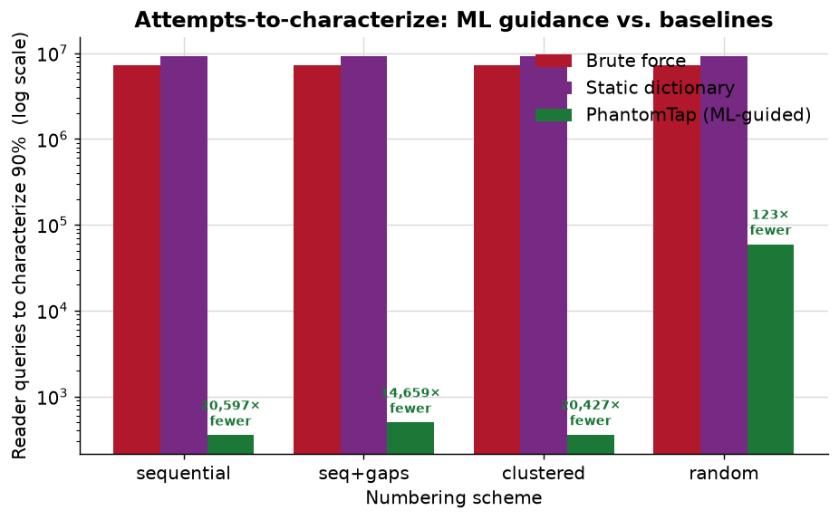
</p>

**2. Bayesian population sizing.** An active-learning boundary search estimates
*how many* credentials a facility has issued — and over what range — in
**O(log N)** reader queries instead of the O(N) an exhaustive scan needs. A
sequential population of 6,400 cards is sized from **~300 queries** to within a
few percent. Randomized numbering defeats it (large error) — again, a *positive*
security signal, surfaced rather than buried.

<p align="center">
  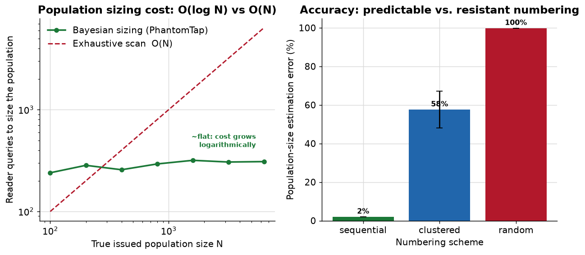
</p>

### More than an auditor: a purple-team platform

PhantomTap doesn't just *model* the attack — it **detects** it. A blue-team
monitor runs four detectors over a stream of badge-reader events:

| Detector | Signature it catches |
|----------|----------------------|
| **impossible travel** | one credential at two readers faster than a human could walk → **cloned/replayed** card |
| **enumeration** | a burst of distinct/rejected creds or a consecutive card-number sweep → someone **scanning** the reader |
| **off-hours** | an accepted access outside declared business hours |
| **rogue credential** | a format-valid card **outside the issued range** → forged or guessed number |

The reflexive result: PhantomTap's **own ML auditor is caught by its own
detector** after ~16–33 presentations — and because guided search walks
consecutive numbers, it's flagged *at any pace*, while unstructured probing can
only hide by going so slow it's useless.

<p align="center">
  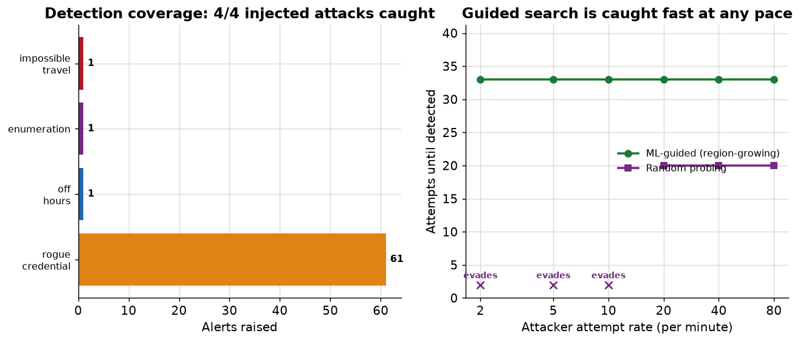
</p>

```bash
phantomtap monitor --numbering sequential      # detect clone / scan / off-hours / rogue
```

### Security risk, measured in bits

Every audit reports an **information-theoretic** score: how many bits of guessing
an adversary faces to forge a valid credential — *before* and *after* reasoning
about structure. The gap is what the deployment **leaks**. Sequential numbering
can collapse an informed attacker's work to **near zero bits** (every number in
the discovered range is valid); randomized numbering preserves it.

<p align="center">
  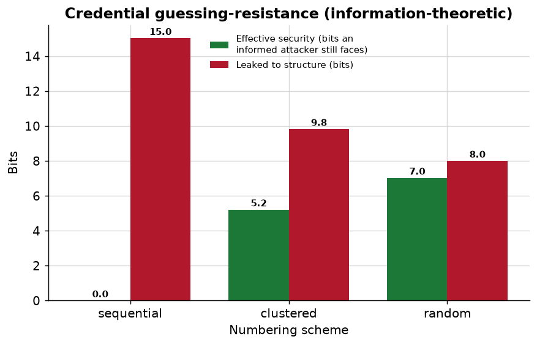
</p>

### Not just a score — a prioritized fix roadmap

An audit that only assigns a number leaves the owner asking "so what do I do
*first*?" PhantomTap answers it. For every candidate hardening step it builds a
counterfactual deployment with that one knob changed, re-scores it, and ranks the
fixes by **risk reduction per fix** — then greedily compounds them into a
sequenced roadmap. Every audit report ends with this table:

| Step | Fix | Risk after | Δ |
|-----:|-----|-----------:|---:|
| 1 | Randomize card numbering | 58 | −24 |
| 2 | Upgrade credential format | 39 | −19 |
| 3 | Rotate off default keys | 27 | −12 |
| 4 | Diversify keys per card | 20 | −7 |

<p align="center">
  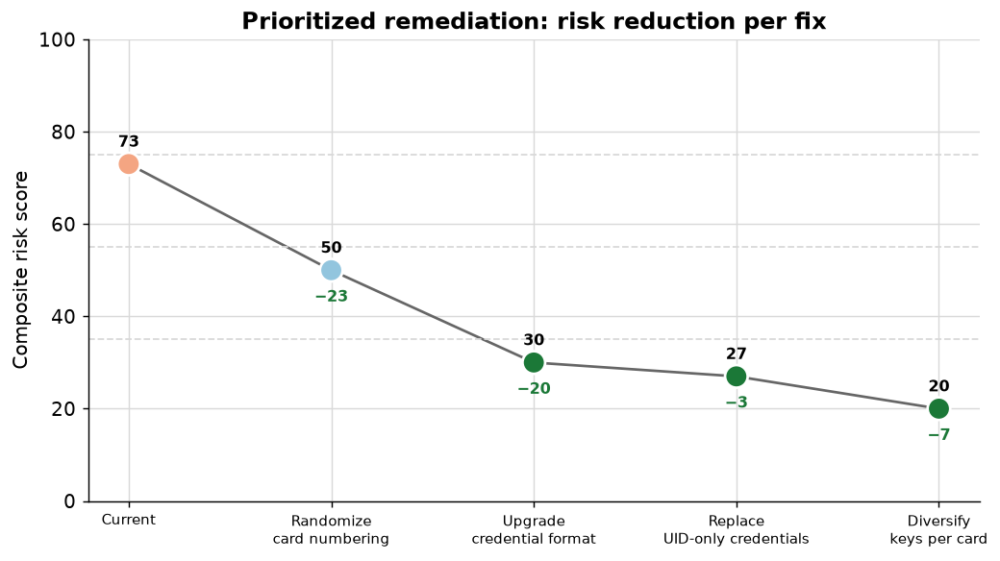
  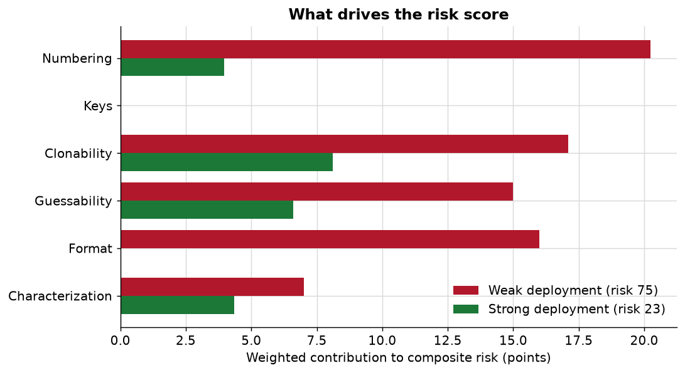
</p>

### Fleet auditing — a campus is as weak as its weakest building

Real estates run *many* facility codes — one per building or department. An
attacker walks in through the softest door, so PhantomTap rolls per-facility
audits up into a **weakest-link** fleet score (the worst building weighted 70%).
The bundled [case study](examples/case_study_campus.md) audits a four-building
campus end-to-end: an old lobby on 26-bit prox drags a datacenter-grade estate
down to **HIGH**.

<p align="center">
  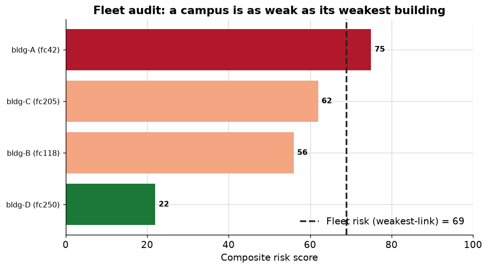
</p>

```bash
phantomtap fleet --format H10306-34         # audit a synthetic multi-building campus
make case-study                             # full report + SARIF into examples/
```

### Attack-path analysis — the path of least resistance to the crown jewels

Per-door scores miss the real risk: an intruder chains the *weakest sequence* of
doors from the street to a high-value asset. PhantomTap models the estate as a
graph (zones = nodes, doors = edges weighted by each reader's audit risk) and
runs Dijkstra to find the **cheapest breach path** — then asks the question no
per-door score can: *hardening which single door raises that path cost the most?*
The answer is frequently **not** the estate's weakest door, and the datacenter's
own strong reader is useless if the intruder walks in through a 26-bit lobby.

<p align="center">
  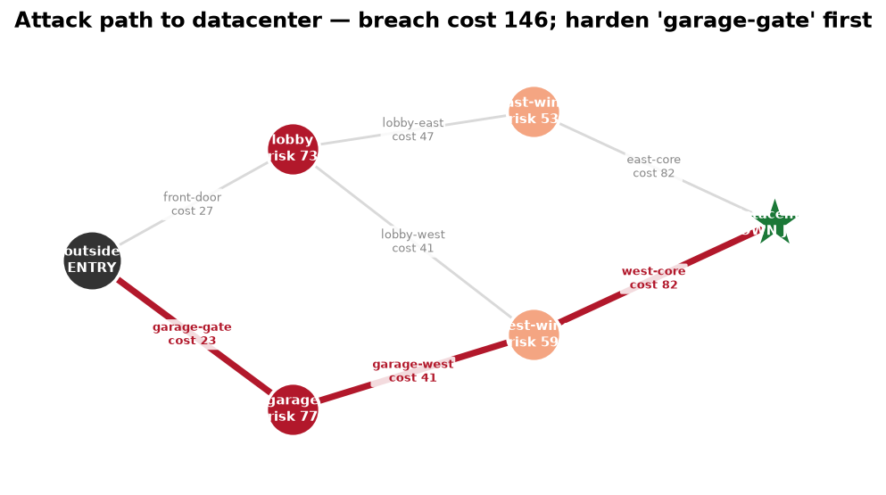
</p>

```bash
phantomtap attackpath --target datacenter   # path of least resistance + chokepoints
```

### Counter-surveillance — rogue-reader / skimmer detection

Inspired by the **[Specter](https://github.com/at0m-b0mb/Specter-FlipperZero)**
project (a *passive* Flipper Zero bug-sweep that listens for the RF carrier a
powered-on reader emits), PhantomTap adds the analysis half. A reader's carrier
has a **timing fingerprint** — polling period, burst width, duty cycle, and the
tell-tale **jitter** of a cheap clone versus a real terminal. PhantomTap
classifies each sensed emitter against a profile library and flags covert
devices — a skimmer taped inside an ATM, a rogue logger under a desk — answering
Specter's four questions: *what is it, where is it (proximity), is the room
clean, did one show up while I was away (watch mode)*. All on a synthetic RF
environment; nothing transmits.

<p align="center">
  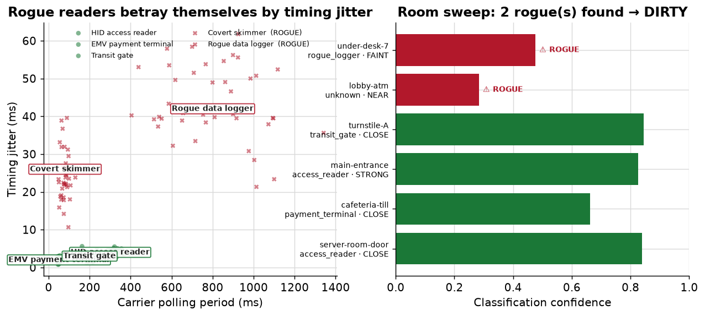
</p>

```bash
phantomtap sweep        # passive RF sweep: classify emitters, flag rogue readers
```

### Findings flow into your security pipeline (SARIF)

Every audit can export **SARIF 2.1.0** — the OASIS standard GitHub code scanning
and security dashboards ingest — so badge-system risk is tracked and triaged
right beside software vulnerabilities.

```bash
phantomtap audit --numbering sequential --sarif findings.sarif
```

### Organizational-intelligence leakage — your badge numbers date your hires

Sequential card numbers leak more than a headcount: because badges are issued in
**hire order**, the number is a proxy for **seniority**. Tie just **two** card
numbers to real dates (a LinkedIn "joined March 2022", a printed issue date) and
a linear fit **dates every other badge in the building** — reconstructing the
org's growth curve and hiring spikes.

- Sequential numbering: **2 anchors** date the whole population to **±24 days**
  (R² 0.999) across a 6-year hiring window, and **3 hiring spikes** stay visible.
- Randomised numbering: the fit collapses (**R² 0.001**, MAE ~740 days) — the
  leak is gone. A concrete argument *for* randomising card numbers.

<p align="center">
  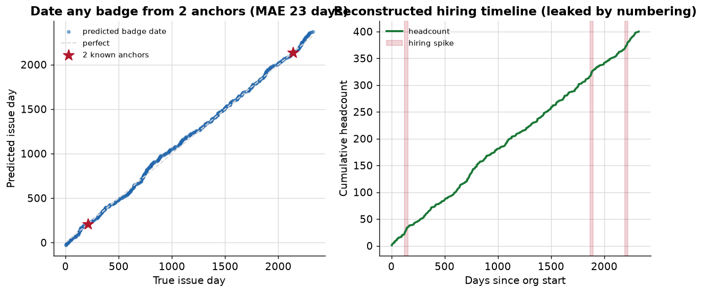
</p>

```bash
phantomtap timeline                 # show the org-intel leak from sequential numbering
phantomtap timeline --randomized    # the defended posture (leak destroyed)
```

### Evaluation metrics — measured, not asserted

Every classifier and detector is scored with standard metrics (precision/recall/
F1, ROC-AUC, PR-AUC, MCC, confusion matrices, and Spearman ranking quality) over
seeded synthetic trials. Full report: [`docs/evaluation.md`](docs/evaluation.md).

| Subsystem | Key metrics |
|-----------|-------------|
| **Rogue-reader detection** | F1 **0.998**, ROC-AUC **1.00**, PR-AUC **1.00**, MCC **0.997** |
| **Anomaly monitor** | mean per-attack recall **1.00**, clean-stream false-alarm rate **0.00** |
| **Format inference** | parity-consistent recall **1.00**, top-1 **0.73**, numbering-class **0.68** |
| **Bayesian sizing** | sequential MAPE **0.03**, randomized-resistance recall **1.00** |
| **Risk score validity** | weak-vs-strong AUC **1.00**, Spearman ρ **1.00** |

> The eval suite also *drives* fixes: it caught a 48% false-alarm rate from
> unrealistic "teleporting" traffic in the stream generator, now **0%** after
> modelling continuous employee movement.

<p align="center">
  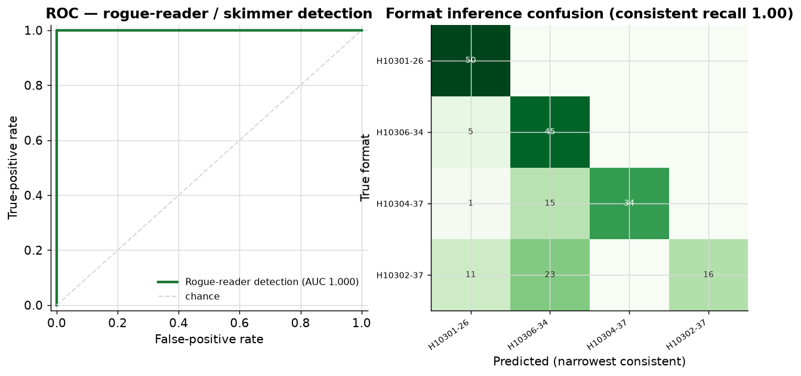
</p>

```bash
phantomtap eval          # precision/recall/F1/AUC across every subsystem
```

## Why it's novel

- The Flipper community builds **tools, not intelligence**. Existing apps
  replay, dump, and dictionary-attack; almost none *learn credential structure*
  and use it to guide search.
- **Credential-format inference from a few observations** is an under-explored,
  tractable ML problem.
- **Bayesian active-learning population sizing** answers "how big is this
  deployment?" in *logarithmic* query cost — a reconnaissance capability distinct
  from exhaustive discovery, and one that degrades *honestly* on hardened
  (randomized) numbering.
- **Information-theoretic risk in bits.** PhantomTap quantifies how much
  credential security a deployment *leaks* to a structure-aware adversary —
  turning "sequential numbering is bad" into "this design leaks ~15 bits."
- **A purple-team loop.** The same platform that models the attack also
  **detects** it: clone detection via impossible travel, enumeration/scan
  detection, off-hours and rogue out-of-range credentials — and it catches
  *its own* ML auditor within ~16–33 reader presentations.
- It **bridges hardware hacking and structured software security** — an embedded
  RF device plus host-side sequence modelling plus a reporting engine.
- **Grounded in real public data.** The default-key detector uses the actual
  community MIFARE dictionary shipped with Proxmark3/libnfc/Flipper, and the
  format taxonomy uses published HID specifications — every source cited.
- The **"auditor" inversion**: turning offensive capability into a scored,
  explainable audit is the practical, defensible contribution.

## Architecture

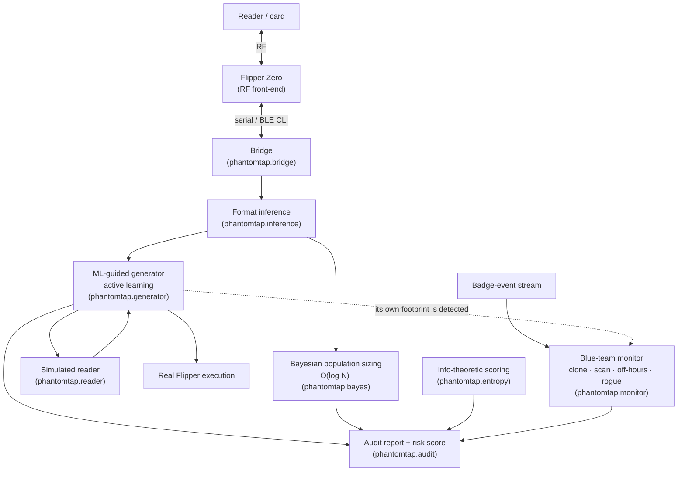

Full write-up: [`docs/architecture.md`](docs/architecture.md).

## Quickstart

```bash
git clone https://github.com/Krishita17/PhantomTap.git
cd PhantomTap
python -m pip install -e .          # Tier-1 core: ZERO third-party deps

# End-to-end walkthrough on a synthetic deployment:
phantomtap demo

# Score a deployment and render an audit report:
phantomtap audit --format H10301-26 --numbering sequential --out report.md

# Attempts-to-characterize: ML vs. dictionary vs. brute force:
phantomtap benchmark --numbering sequential

# Blue-team: detect clone / scan / off-hours / rogue events in a badge stream:
phantomtap monitor --numbering sequential
```

The **entire Tier-1 pipeline runs on the Python standard library alone** — no
hardware, no heavy dependencies. Figures and tests add `matplotlib`, `numpy`,
and `pytest`:

```bash
python -m pip install -e ".[dev]"
make test          # 74 tests
make figures       # regenerate every chart into docs/figures/
make benchmark     # regenerate docs/benchmark_results.md
```

## What you get

### 1. Format inference from a few reads

```text
$ phantomtap demo
2. Auditor captures 8 card reads:
    H10301-26 FC=83 CN=11067 raw=0x2A65677 parity=ok
    ...
3. Inferred structure from those 8 reads:
    { "format": "H10301-26", "facility_code": 83,
      "numbering": "sequential", "card_lo": 10944, "card_hi": 11305, ... }
4. Attempts-to-characterize (queries to map 90% of the population):
      bruteforce: 5,450,824
      dictionary: 7,416,904
              ml: 443
   -> PhantomTap is ~12,304x more efficient.
```

### 2. A scored, explainable audit report

See the full rendered example: [`examples/sample_audit_report.md`](examples/sample_audit_report.md).

| # | Severity | Factor | Finding |
|---|----------|--------|---------|
| 1 | 🟥 CRITICAL | `numbering` | Card numbers issued strictly sequentially |
| 2 | 🟥 CRITICAL | `keys` | Sectors still carry publicly documented default keys |
| 3 | 🟧 HIGH | `format` | H10301-26 (26-bit): tiny 8-bit facility space |
| … | … | … | … |

## Results

Median over 8 seeds · 8 observed cards · 400 issued credentials per deployment.
Full table + JSON: [`docs/benchmark_results.md`](docs/benchmark_results.md).

| Format | Numbering | Brute force | Dictionary | **ML (PhantomTap)** | Speedup | Fmt acc | Num acc |
|--------|-----------|------------:|-----------:|--------------------:|--------:|:------:|:------:|
| H10301-26 | sequential | 7,977,297 | 9,943,377 | **353** | 22,599× | 1.00 | 1.00 |
| H10301-26 | clustered  | 8,011,137 | 9,977,217 | **357** | 22,440× | 1.00 | 0.12 |
| H10301-26 | random     | 8,022,236 | 9,988,316 | **59,151** | 136× | 1.00 | 1.00 |
| H10306-34 | sequential | 7,977,297 | 9,943,377 | **353** | 22,599× | 1.00 | 1.00 |
| N10002-34 | sequential | 7,977,297 | 9,943,377 | **353** | 22,599× | 1.00 | 1.00 |
| H10304-37 | sequential | 63,715,665 | 79,444,305 | **353** | 180,498× | 1.00 | 1.00 |
| H10304-37 | random     | 64,178,091 | 79,906,731 | **474,255** | 135× | 1.00 | 1.00 |
| H10302-37 | sequential | 19,768 | 19,768 | **353** | 56× | 1.00 | 1.00 |
| H10302-37 | random     | 944,700 | 944,700 | **943,833** | **1×** | 1.00 | 0.00 |

**Median ML speedup across all 20 configs: 16,067×** (min 1×, max 180,498×).
(H10306-34 and N10002-34 produce identical rows — they're structural aliases,
a nice consistency check on the Proxmark-aligned encoder.)

**How the win works.** ML makes two moves the baselines can't: it (1) *locks the
facility code* inferred from the reads (dividing the space by the whole
facility range), and (2) *region-grows* over card numbers from the observed
cluster, walking a sequential/clustered population directly instead of scanning
empty low-numbered space. Even on **random** numbering — where region-growing
gives no signal — locking the facility code alone yields a ~135× win.

**Where it *doesn't* win — and why that matters.** The facility-less **H10302**
format has no facility code to lock, so brute force is already cheap and ML's
edge shrinks (56× on sequential). Combine it with **randomized** numbering and
guided search collapses to **1×** — no better than brute force. That row is the
whole thesis in miniature: PhantomTap's advantage *is* the deployment's
structural weakness, so "PhantomTap can't help an attacker here" reads directly
as "this design is hard to audit — good." The benchmark surfaces it, unedited.

<p align="center">
  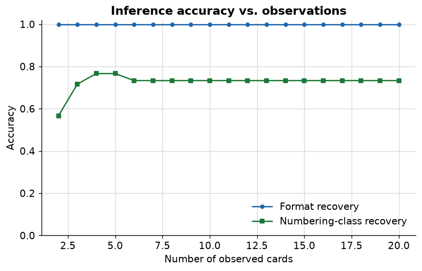
  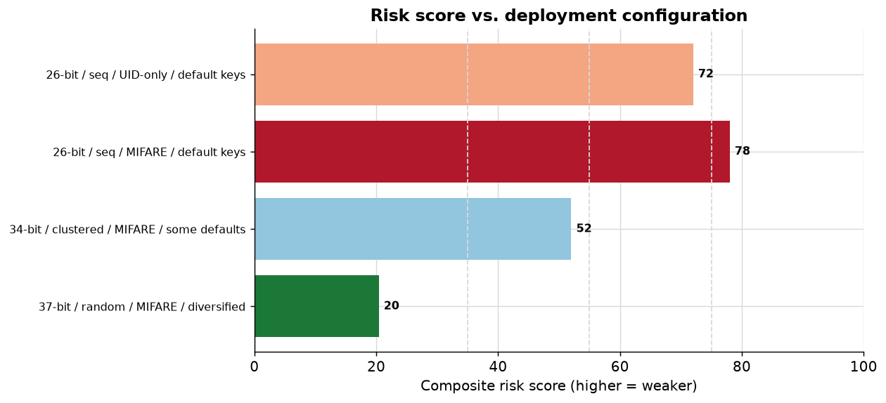
</p>
<p align="center">
  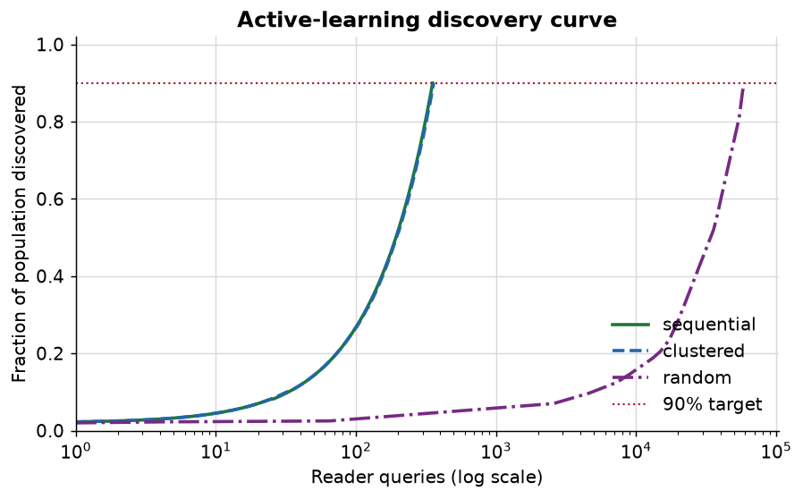
</p>

### Honest limitations

- **Width ambiguity.** A wide format carrying small values leaves its
  high-order bits zero and is *parity-indistinguishable* from a narrower format.
  PhantomTap reports the **narrowest consistent** format and lists the wider
  ones it is also consistent with (that's what the "Fmt acc" = consistent
  recovery measures).
- **Clustered vs. sequential** is genuinely hard from a sparse 8-card sample
  (`Num acc ≈ 0.12` for clustered); both collapse into a "predictable" class.
  This is reported, not hidden.

## Credential-format taxonomy

Field offsets and parity ranges are **aligned to the Proxmark3 reference
implementation** (`wiegand_formats.c`), so PhantomTap's encoder is bit-compatible
with real tooling for every format below.

| Format | Bits | Facility | Card | Known weakness |
|--------|-----:|---------:|-----:|----------------|
| H10301-26 | 26 | 8-bit (0–255) | 16-bit | Tiny facility space; trivial to guess/collide |
| H10306-34 | 34 | 16-bit | 16-bit | 16-bit card space stays enumerable (alias of N10002) |
| N10002-34 | 34 | 16-bit | 16-bit | Structurally identical to H10306-34 |
| H10304-37 | 37 | 16-bit | 19-bit | Resists enumeration, but sequential numbering is fully predictable |
| H10302-37 | 37 | **none** | 35-bit | No facility field to divide the space by → markedly *more* enumerable |

Card families audited — **EM4100/HID Prox** (125 kHz, UID-only, *no*
authentication, trivially cloned), **MIFARE Classic** (Crypto-1, academically
broken), and the hardened **DESFire EV2/EV3** target — are catalogued with the
primary security literature in
[`data/reference/card_families_and_context.md`](data/reference/card_families_and_context.md).

All references are real, public, and cited: HID + Proxmark3 format specs, the
community MIFARE key dictionary, and the Crypto-1/MIFARE cryptanalysis papers.
[`wiegand_formats.md`](data/reference/wiegand_formats.md)
· [`default_keys.md`](data/reference/default_keys.md)
· [`mifare_default_keys.dic`](data/reference/mifare_default_keys.dic)
· [`card_families_and_context.md`](data/reference/card_families_and_context.md)

### Sample datasets

Five reproducible synthetic datasets ship in
[`data/synthetic/`](data/synthetic/) — a classic weak 26-bit deployment, a
hardened 37-bit one, an H10306 departmental-block layout, a clonable UID-only
prox set, and a **240-credential multi-building campus** spanning three facility
codes. Regenerate them any time with `make samples` (all frames produced by the
Proxmark-aligned encoder; no real facility data).

## Project layout

```
phantomtap/
  formats.py      Wiegand formats (Proxmark3-aligned parity + encode/decode)
  population.py   synthetic credential-population generator (the workbench)
  reader.py       simulated reader (accept/reject oracle, counts queries)
  inference.py    format-inference parser (format, facility, numbering, range)
  generator.py    brute-force / dictionary baselines + ML-guided auditor
  bayes.py        Bayesian active-learning population-size estimator (O(log N))
  entropy.py      information-theoretic guessing-resistance (security in bits)
  monitor.py      blue-team detectors + synthetic badge-event stream + red-vs-blue
  remediation.py  prioritized "what-if" fix roadmap (risk reduction per fix)
  fleet.py        multi-facility campus audit (weakest-link roll-up)
  attackgraph.py  physical attack-path analysis (Dijkstra + chokepoint ranking)
  rfsweep.py      rogue-reader / skimmer detection by RF carrier fingerprint
  evaluation.py   metrics core + per-subsystem evaluators (P/R/F1/AUC/MCC)
  timeline.py     org-intel leakage: date badges + hiring-curve reconstruction
  sarif.py        SARIF 2.1.0 export (security-dashboard integration)
  audit.py        weighted risk scoring + Markdown report renderer
  bridge.py       Tier-2 Flipper Zero serial bridge (+ hardware-free mock)
  keys.py         publicly documented default keys (real dictionary, for detection)
  cli.py          `phantomtap` command-line entry point
scripts/          make_figures · run_benchmark · make_samples · run_eval · case_study · demo
tests/            74 pytest cases
docs/             architecture · threat_model · figures · benchmark results
data/             synthetic samples + public reference material
examples/         a rendered sample audit report
```

## Roadmap (tiers)

- [x] **Tier 1 — software pipeline (no hardware).** Inference + ML-guided
  generator + Bayesian population sizing + information-theoretic scoring +
  blue-team detection + audit report, benchmarked against baselines. *(This repo.)*
- [ ] **Tier 2 — hardware integration.** Drive a real Flipper over its serial
  CLI on the author's own cards/readers. Seam is [`phantomtap/bridge.py`](phantomtap/bridge.py).
- [ ] **Tier 3 — research payoff.** Upgrade the generator to a richer
  sequence/active-learning model; expand the deployment-weakness study.

## Threat model & ethics

PhantomTap is for **authorized, defensive** assessment and research. Testing any
system you do not own requires prior written authorization from its owner. The
repo ships no real facility credentials, no site-specific keys, and no
"clone-a-stranger's-badge" workflow. Read [`docs/threat_model.md`](docs/threat_model.md)
before using the hardware path.

## Citation

If you use PhantomTap, please cite it — see [`CITATION.cff`](CITATION.cff).

## Author

**Krishita Sanjay Choksi** — sole author and contributor.

## Acknowledgements

Portions of the scaffolding and documentation were drafted with AI assistance
and reviewed by the author. The design, framing, and all experimental results
are the author's own.

## License

[MIT](LICENSE), with a responsible-use notice.
