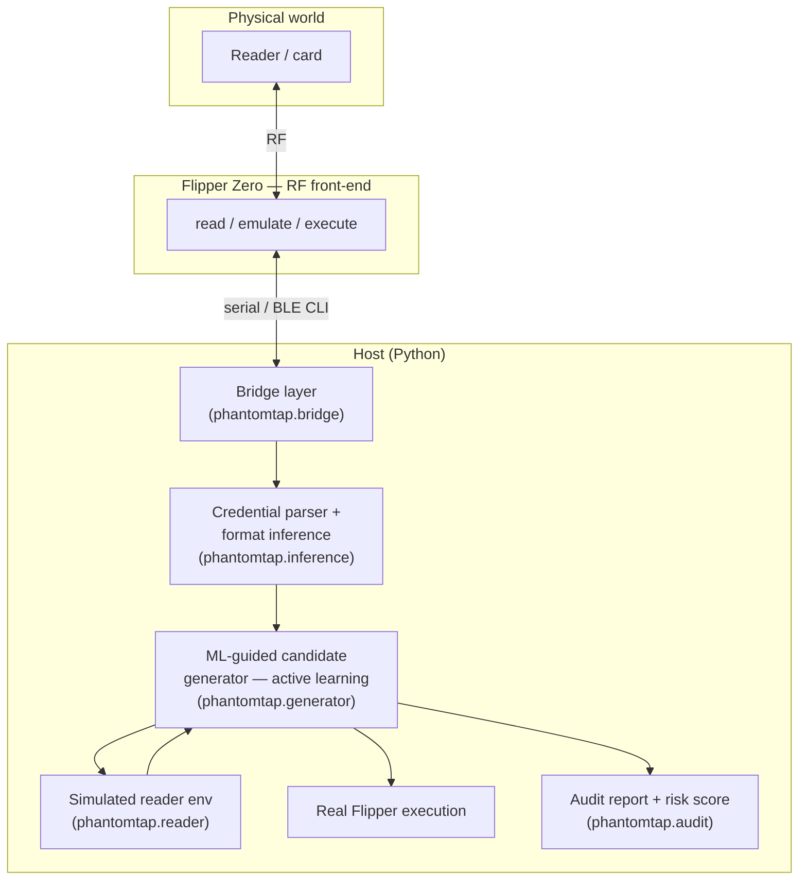

# PhantomTap architecture

PhantomTap pairs a Flipper Zero (the RF front-end / hardware executor) with a
host-side "brain" that learns credential structure, generates the next best test
credential instead of brute-forcing, and produces a scored access-control audit.

## Components

| Component | Module | Role |
|-----------|--------|------|
| Flipper front-end | (hardware) | Reads UIDs/blocks, emulates, executes one test. Driven by the host, not tapped by hand. |
| Bridge | `phantomtap.bridge` | Scripts the Flipper CLI over USB serial. `MockFlipperBridge` runs the same path with no hardware. |
| Format inference | `phantomtap.inference` | From a handful of reads, recover format, facility code, numbering scheme, and issued range. |
| Candidate generator | `phantomtap.generator` | Brute-force / dictionary baselines vs. the ML-guided active-learning auditor. |
| Simulated reader | `phantomtap.reader` | Accept/reject oracle that counts queries — the basis of the efficiency metric. |
| Population generator | `phantomtap.population` | Synthesizes realistic deployments with ground truth for benchmarking. |
| Audit + scoring | `phantomtap.audit` | Weighted, explainable risk score with ranked findings and remediation. |

## The three tiers

- **Tier 1 — software pipeline (no hardware).** Format inference + ML-guided
  generator + audit report, benchmarked against baselines on synthetic
  populations. A complete, novel result on its own.
- **Tier 2 — hardware integration.** The Flipper over its serial CLI: script
  reads, drive the parser on genuine card data, execute selected candidates
  against the auditor's own reader/cards. `phantomtap.bridge` is the seam.
- **Tier 3 — research payoff.** Active-learning discovery curves and a
  deployment-weakness sensitivity study across many synthetic configurations.

## Where the novelty lives

1. **Format inference from few observations** — guess the encoding from a few
   reads instead of eyeballing hex.
2. **ML-guided candidate ordering** — an active-learning policy that measurably
   cuts attempts-to-characterize versus static dictionaries / brute force.
3. **A credential-space model** — a compact representation of a facility's
   population that predicts plausible neighbours.
4. **The scored audit inversion** — turn all of the above into an explainable,
   prioritized access-control risk report.
